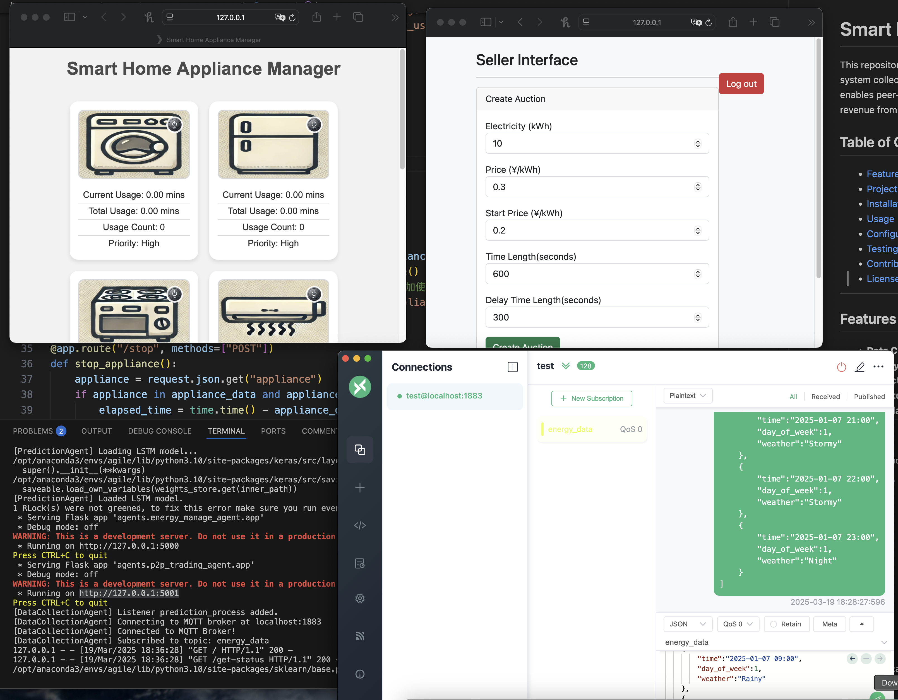
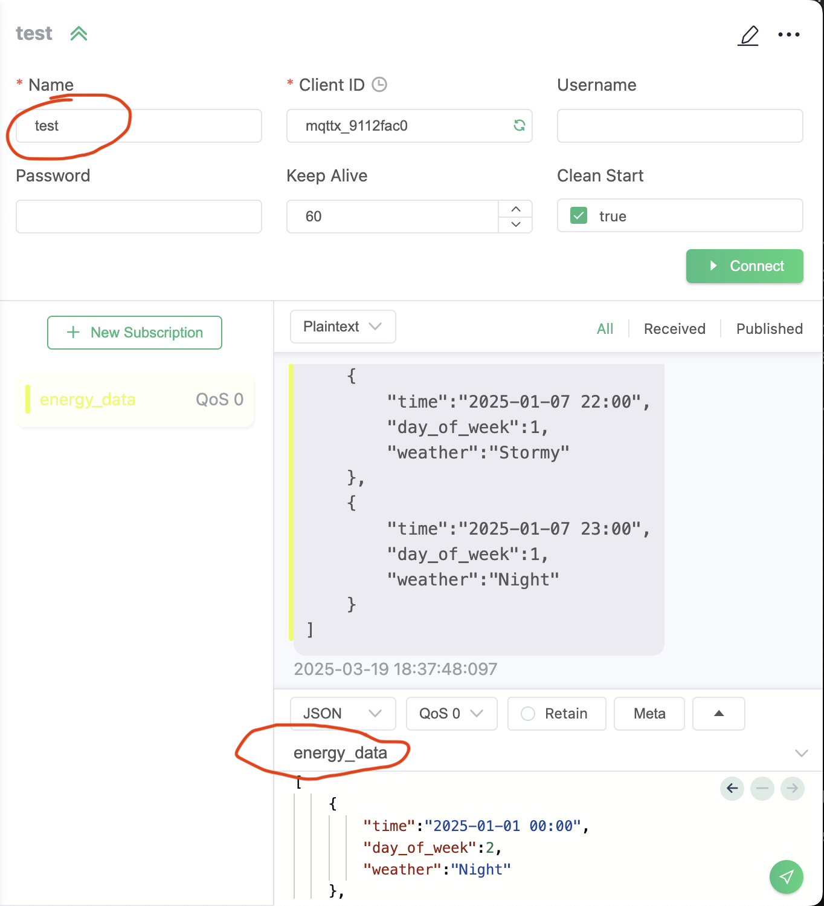

# Smart Home Energy Management System

This repository contains a modular, extensible framework for managing and optimizing energy usage in a smart home environment. The system collects data from various sources, predicts energy consumption and production, executes energy management strategies, and enables peer-to-peer (P2P) energy trading. The goal is to help homeowners reduce costs, increase energy efficiency, and potentially earn revenue from surplus energy.





## Table of Contents
- [Smart Home Energy Management System](#smart-home-energy-management-system)
  - [Table of Contents](#table-of-contents)
  - [Features](#features)
  - [Project Structure](#project-structure)
  - [Usage](#usage)
    - [Set up environment](#set-up-environment)
    - [Run the project](#run-the-project)
    - [Use the Web Interface](#use-the-web-interface)
  - [Configuration](#configuration)
    - [Use MQTT IoT Simulation](#use-mqtt-iot-simulation)
    - [The MQTT Data type](#the-mqtt-data-type)
  - [Testing](#testing)
  - [Contributing](#contributing)
  - [License](#license)

---

## Features

- **Data Collection**: Gather real-time or historical data on energy consumption, generation, and external factors (e.g., weather).
- **Energy Management**: Dynamically adjust device usage schedules, battery storage, and other parameters to optimize energy usage.
- **Prediction**: Forecast future energy needs and generation based on historical data and external inputs (e.g., weather forecasts).
- **Peer-to-Peer Trading**: Trade surplus energy with neighboring homes or community microgrids to maximize cost savings or profit.
- **Modular Design**: Agents are designed to be independent, making it easy to extend or replace components as needed.

---

## Project Structure

    home-energy-system/
    ├── agents/
    │   ├── pycache/
    │   ├── data_collection_agent.py
    │   ├── energy_management_agent
    │   ├── p2p_trading_agent
    │   └── prediction_agent.py
    ├── models/
    ├── static/
    ├── utils/
    │   ├── config.py
    │   ├── data_loader.py
    │   └── db_handler.py
    │   └── generate_energy_dataset.py
    │   └── weather_forecast.py
    ├── LICENSE
    ├── README.md
    ├── run.py
    └── test.py

- **agents/**  
  - **data_collection_agent.py**: Interfaces with sensors, APIs, or data sources to collect consumption/generation data.  
  - **energy_management_agent**: Implements logic for optimizing energy usage (e.g., scheduling, load shifting).  
  - **p2p_trading_agent**: Manages surplus energy trading between multiple participants.  
  - **prediction_agent.py**: Uses machine learning or statistical methods to forecast energy consumption/production.

- **models/**  
  - Contains machine learning or statistical models used by the prediction agent.  
  - You can store pre-trained models or training scripts here.

- **utils/**  
  - **config.py**: Centralized configuration (e.g., database credentials, API keys, environment settings).  
  - **data_loader.py**: Helper functions to load and preprocess data from various sources.  
  - **db_handler.py**: Handles database connections, queries, and data storage.

- **run.py**  
  - Main entry point to run the system. Instantiates agents, loads configuration, and orchestrates the workflow.

- **test.py**  
  - Basic test script or entry point for unit tests. Ensures system components work as expected.

- **LICENSE**  
  - The open-source license governing this project.  

- **README.md**  
  - Project documentation (you are here).

---

## Usage

### Set up environment

    # make sure you have python3.10, install all the dependencies
    pip install -r requirement.txt


### Run the project

    python run.py

### Use the Web Interface
    # energy management agent
    http://127.0.0.1:5000
    # p2p trading agent
    http://127.0.0.1:5001


---

## Configuration

### Use MQTT IoT Simulation

    # install mqtt server on your computer
    https://mosquitto.org/download/
    # install mqtt client interface
    https://mosquitto.org/download/
    # connect the mqtt server with the setting, see image
    connection name: test
    subscription topic: energy_data



### The MQTT Data type
   Please refer to static/dataset.md

   A sample input in MQTT is given by static/sample_input.txt


---

## Testing

The repository includes basic tests to ensure that each component of the system functions as expected.

- **Run Tests:**
  - Execute the test script using:
    ```bash
    python test.py
    ```
  - You can also integrate with your preferred testing framework (e.g., `pytest`) to extend coverage.

- **Test Coverage:**
  - Unit tests are provided for key modules such as data collection, energy management, and prediction.
  - Contributions are welcome to improve test coverage and add tests for new features.

Ensure all tests pass before submitting any changes.

---

## Contributing

TBD

---

## License

This project is licensed under the Apache License 2.0. See the [LICENSE](LICENSE) file for more details.

---